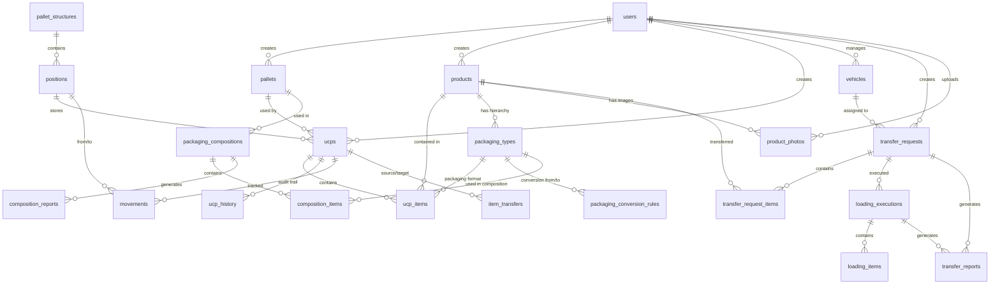

# Database Schema Documentation

## Overview

The WMS database is built on PostgreSQL and uses Drizzle ORM for type-safe database operations. The schema supports complex warehouse operations including multi-level packaging, transfer management, and comprehensive audit trails.

## Database Configuration

- **Database**: PostgreSQL 14+
- **ORM**: Drizzle ORM
- **Connection Pool**: pg-pool with configurable settings
- **Migration Tool**: Drizzle Kit
- **Schema Validation**: Zod schemas for runtime validation

## Core Entity Relationships



## Table Definitions

### User Management

#### `users`
Core user authentication and authorization.

```sql
CREATE TABLE users (
  id SERIAL PRIMARY KEY,
  email VARCHAR(255) NOT NULL UNIQUE,
  password VARCHAR(255) NOT NULL,
  first_name VARCHAR(100),
  last_name VARCHAR(100),
  role VARCHAR(50) NOT NULL DEFAULT 'operator', -- admin, operator
  created_at TIMESTAMP DEFAULT NOW(),
  updated_at TIMESTAMP DEFAULT NOW()
);
```

**Indexes:**
- `UNIQUE INDEX` on `email`
- `INDEX` on `role` for role-based queries

#### `sessions`
Express session storage.

```sql
CREATE TABLE sessions (
  sid VARCHAR PRIMARY KEY,
  sess JSONB NOT NULL,
  expire TIMESTAMP NOT NULL
);
```

### Warehouse Infrastructure

#### `pallets`
Physical pallets used in the warehouse.

```sql
CREATE TABLE pallets (
  id SERIAL PRIMARY KEY,
  code VARCHAR NOT NULL UNIQUE,
  type VARCHAR NOT NULL, -- PBR, Europeu, Chep, etc.
  material VARCHAR NOT NULL, -- Madeira, Plástico, Metal
  width INTEGER NOT NULL, -- cm
  length INTEGER NOT NULL, -- cm
  height INTEGER NOT NULL, -- cm
  max_weight DECIMAL(10,2) NOT NULL, -- kg
  status VARCHAR NOT NULL DEFAULT 'disponivel', 
  -- disponivel, em_uso, defeituoso, recuperacao, descarte
  photo_url VARCHAR,
  observations TEXT,
  last_inspection_date DATE,
  created_by INTEGER NOT NULL REFERENCES users(id),
  created_at TIMESTAMP DEFAULT NOW(),
  updated_at TIMESTAMP DEFAULT NOW()
);
```

**Indexes:**
- `UNIQUE INDEX` on `code`
- `INDEX` on `status` for availability queries
- `INDEX` on `type` for pallet type filtering

#### `pallet_structures`
Rack structures that hold pallets.

```sql
CREATE TABLE pallet_structures (
  id SERIAL PRIMARY KEY,
  name VARCHAR NOT NULL, -- Nome da estrutura
  street VARCHAR NOT NULL, -- 01, 02, 03...
  side VARCHAR NOT NULL, -- E (Esquerdo), D (Direito)
  max_positions INTEGER NOT NULL, -- número de posições (1-7)
  max_levels INTEGER NOT NULL, -- número de níveis (0-3)
  rack_type VARCHAR DEFAULT 'conventional', 
  -- Convencional, Drive-in, Push-back
  status VARCHAR NOT NULL DEFAULT 'active',
  observations TEXT,
  created_by INTEGER NOT NULL REFERENCES users(id),
  created_at TIMESTAMP DEFAULT NOW(),
  updated_at TIMESTAMP DEFAULT NOW()
);
```

#### `positions`
Individual storage positions within rack structures.

```sql
CREATE TABLE positions (
  id SERIAL PRIMARY KEY,
  code VARCHAR NOT NULL UNIQUE, -- PP-01-01-0 formato
  structure_id INTEGER REFERENCES pallet_structures(id),
  street VARCHAR NOT NULL, -- 01, 02, 03...
  side VARCHAR NOT NULL, -- E (Esquerdo), D (Direito)
  corridor VARCHAR, -- Campo existente no banco
  position INTEGER NOT NULL, -- 1, 2, 3, 4, 5, 6, 7
  level INTEGER NOT NULL, -- 0, 1, 2, 3
  rack_type VARCHAR, -- Tipo do rack
  max_pallets INTEGER NOT NULL DEFAULT 1,
  restrictions TEXT, -- Restrições da posição
  status VARCHAR NOT NULL DEFAULT 'disponivel', 
  -- disponivel, ocupada, reservada, manutencao, bloqueada
  current_pallet_id INTEGER REFERENCES pallets(id),
  observations TEXT,
  created_by INTEGER REFERENCES users(id),
  created_at TIMESTAMP DEFAULT NOW(),
  updated_at TIMESTAMP DEFAULT NOW(),
  has_division BOOLEAN DEFAULT FALSE,
  layout_config JSONB -- Configuração do layout visual
);
```

**Indexes:**
- `UNIQUE INDEX` on `code`
- `INDEX` on `status` for availability queries
- `INDEX` on `structure_id` for structure-based queries
- `COMPOSITE INDEX` on `(street, side, position, level)` for location queries

### Product Management

#### `products`
Product catalog with specifications.

```sql
CREATE TABLE products (
  id SERIAL PRIMARY KEY,
  sku VARCHAR NOT NULL UNIQUE,
  name VARCHAR NOT NULL,
  description TEXT,
  category VARCHAR,
  brand VARCHAR,
  unit VARCHAR NOT NULL, -- un, kg, l, etc.
  weight DECIMAL(10,3), -- kg
  dimensions JSONB, -- {width, length, height}
  barcode VARCHAR,
  requires_lot BOOLEAN DEFAULT FALSE,
  requires_expiry BOOLEAN DEFAULT FALSE,
  min_stock INTEGER DEFAULT 0,
  max_stock INTEGER,
  is_active BOOLEAN DEFAULT TRUE,
  created_by INTEGER NOT NULL REFERENCES users(id),
  created_at TIMESTAMP DEFAULT NOW(),
  updated_at TIMESTAMP DEFAULT NOW()
);
```

**Indexes:**
- `UNIQUE INDEX` on `sku`
- `INDEX` on `barcode` for scanning operations
- `INDEX` on `category` for categorization
- `FULL TEXT INDEX` on `name, description` for search
- `INDEX` on `is_active` for active product filtering

#### `product_photos`
Product image management with thumbnails.

```sql
CREATE TABLE product_photos (
  id SERIAL PRIMARY KEY,
  product_id INTEGER NOT NULL REFERENCES products(id),
  filename VARCHAR NOT NULL, -- Original filename
  path VARCHAR NOT NULL, -- Storage path
  url VARCHAR NOT NULL, -- Original resolution URL
  thumbnail_url VARCHAR, -- Thumbnail resolution URL
  size INTEGER NOT NULL, -- File size in bytes
  mime_type VARCHAR NOT NULL, -- image/jpeg, image/png, etc.
  width INTEGER, -- Image width in pixels
  height INTEGER, -- Image height in pixels
  is_primary BOOLEAN DEFAULT FALSE, -- Main product photo
  uploaded_by INTEGER NOT NULL REFERENCES users(id),
  uploaded_at TIMESTAMP DEFAULT NOW(),
  is_active BOOLEAN DEFAULT TRUE
);
```

**Indexes:**
- `INDEX` on `product_id`
- `UNIQUE INDEX` on `(product_id)` WHERE `is_primary = TRUE` -- Only one primary photo per product

#### `product_photo_history`
Audit trail for photo changes.

```sql
CREATE TABLE product_photo_history (
  id SERIAL PRIMARY KEY,
  product_id INTEGER NOT NULL REFERENCES products(id),
  photo_id INTEGER REFERENCES product_photos(id),
  action VARCHAR NOT NULL, -- 'added', 'removed', 'set_primary', 'unset_primary'
  filename VARCHAR,
  is_primary BOOLEAN,
  performed_by INTEGER NOT NULL REFERENCES users(id),
  performed_at TIMESTAMP DEFAULT NOW(),
  notes TEXT
);
```

### Packaging System

#### `packaging_types`
Hierarchical packaging structure for products.

```sql
CREATE TABLE packaging_types (
  id SERIAL PRIMARY KEY,
  product_id INTEGER NOT NULL REFERENCES products(id),
  name VARCHAR(100) NOT NULL,
  barcode VARCHAR(255),
  base_unit_quantity DECIMAL(10,3) NOT NULL,
  is_base_unit BOOLEAN DEFAULT FALSE,
  parent_packaging_id INTEGER,
  level INTEGER NOT NULL DEFAULT 1,
  dimensions JSONB,
  is_active BOOLEAN DEFAULT TRUE,
  created_by INTEGER NOT NULL REFERENCES users(id),
  created_at TIMESTAMP DEFAULT NOW(),
  updated_at TIMESTAMP DEFAULT NOW()
);
```

**Constraints:**
- `UNIQUE INDEX` on `(product_id)` WHERE `is_base_unit = TRUE` -- Only one base unit per product
- `UNIQUE INDEX` on `barcode` WHERE `barcode IS NOT NULL`

#### `packaging_conversion_rules`
Conversion factors between packaging types.

```sql
CREATE TABLE packaging_conversion_rules (
  id SERIAL PRIMARY KEY,
  from_packaging_id INTEGER NOT NULL REFERENCES packaging_types(id),
  to_packaging_id INTEGER NOT NULL REFERENCES packaging_types(id),
  conversion_factor DECIMAL(10,3) NOT NULL,
  is_active BOOLEAN DEFAULT TRUE,
  created_at TIMESTAMP DEFAULT NOW()
);
```

**Constraints:**
- `UNIQUE INDEX` on `(from_packaging_id, to_packaging_id)`

### UCP Management

#### `ucps`
Unidades de Carga Paletizada (Palletized Load Units).

```sql
CREATE TABLE ucps (
  id SERIAL PRIMARY KEY,
  code VARCHAR NOT NULL UNIQUE, -- UCP-20250618-0001
  pallet_id INTEGER REFERENCES pallets(id),
  position_id INTEGER REFERENCES positions(id),
  status VARCHAR NOT NULL DEFAULT 'active', -- active, empty, archived
  observations TEXT,
  created_by INTEGER NOT NULL REFERENCES users(id),
  created_at TIMESTAMP DEFAULT NOW(),
  updated_at TIMESTAMP DEFAULT NOW()
);
```

**Indexes:**
- `UNIQUE INDEX` on `code`
- `INDEX` on `status` for status filtering
- `INDEX` on `position_id` for location queries

#### `ucp_items`
Products within UCPs with packaging information.

```sql
CREATE TABLE ucp_items (
  id SERIAL PRIMARY KEY,
  ucp_id INTEGER NOT NULL REFERENCES ucps(id),
  product_id INTEGER NOT NULL REFERENCES products(id),
  quantity DECIMAL(10,3) NOT NULL,
  lot VARCHAR,
  expiry_date DATE,
  internal_code VARCHAR, -- CI - Código Interno
  packaging_type_id INTEGER REFERENCES packaging_types(id),
  packaging_quantity DECIMAL(10,3),
  added_by INTEGER NOT NULL REFERENCES users(id),
  added_at TIMESTAMP DEFAULT NOW(),
  removed_by INTEGER REFERENCES users(id),
  removed_at TIMESTAMP,
  removal_reason TEXT,
  is_active BOOLEAN DEFAULT TRUE
);
```

**Indexes:**
- `INDEX` on `ucp_id`
- `INDEX` on `product_id`
- `INDEX` on `is_active` for active items
- `INDEX` on `lot` for lot tracking
- `INDEX` on `expiry_date` for FIFO operations

#### `ucp_history`
Complete audit trail for UCP operations.

```sql
CREATE TABLE ucp_history (
  id SERIAL PRIMARY KEY,
  ucp_id INTEGER NOT NULL REFERENCES ucps(id),
  action VARCHAR NOT NULL, 
  -- created, item_added, item_removed, moved, status_changed, dismantled
  description TEXT NOT NULL,
  old_value JSONB, -- Previous state
  new_value JSONB, -- New state after change
  item_id INTEGER REFERENCES ucp_items(id),
  from_position_id INTEGER REFERENCES positions(id),
  to_position_id INTEGER REFERENCES positions(id),
  performed_by INTEGER NOT NULL REFERENCES users(id),
  timestamp TIMESTAMP DEFAULT NOW()
);
```

**Indexes:**
- `INDEX` on `ucp_id`
- `INDEX` on `action` for action filtering
- `INDEX` on `timestamp` for chronological queries

#### `item_transfers`
Detailed transfer records between UCPs.

```sql
CREATE TABLE item_transfers (
  id SERIAL PRIMARY KEY,
  source_ucp_id INTEGER NOT NULL REFERENCES ucps(id),
  target_ucp_id INTEGER NOT NULL REFERENCES ucps(id),
  source_item_id INTEGER REFERENCES ucp_items(id),
  target_item_id INTEGER REFERENCES ucp_items(id),
  product_id INTEGER NOT NULL REFERENCES products(id),
  quantity DECIMAL(10,3) NOT NULL,
  lot VARCHAR,
  reason TEXT NOT NULL,
  transfer_type VARCHAR NOT NULL, -- 'partial' | 'complete'
  performed_by INTEGER NOT NULL REFERENCES users(id),
  created_at TIMESTAMP DEFAULT NOW()
);
```

### Movement Tracking

#### `movements`
General movement history for all warehouse operations.

```sql
CREATE TABLE movements (
  id SERIAL PRIMARY KEY,
  type VARCHAR NOT NULL, -- reception, shipment, transfer, adjustment
  ucp_id INTEGER REFERENCES ucps(id),
  product_id INTEGER REFERENCES products(id),
  from_position_id INTEGER REFERENCES positions(id),
  to_position_id INTEGER REFERENCES positions(id),
  quantity DECIMAL(10,3),
  lot VARCHAR,
  reason TEXT,
  performed_by INTEGER NOT NULL REFERENCES users(id),
  created_at TIMESTAMP DEFAULT NOW()
);
```

**Indexes:**
- `INDEX` on `type` for movement type filtering
- `INDEX` on `created_at` for time-based queries
- `INDEX` on `performed_by` for user activity tracking

### Vehicle Management

#### `vehicles`
Fleet vehicle registration and specifications.

```sql
CREATE TABLE vehicles (
  id SERIAL PRIMARY KEY,
  code VARCHAR NOT NULL UNIQUE,
  name VARCHAR NOT NULL,
  brand VARCHAR NOT NULL, -- Mercedes-Benz, Volvo, etc.
  model VARCHAR NOT NULL, -- Atego 1719, FH540, etc.
  license_plate VARCHAR NOT NULL,
  type VARCHAR NOT NULL, -- Caminhão, Van, etc.
  weight_capacity VARCHAR NOT NULL, -- "5000 kg"
  cargo_area_length DECIMAL(10,3) NOT NULL, -- metros
  cargo_area_width DECIMAL(10,3) NOT NULL, -- metros
  cargo_area_height DECIMAL(10,3) NOT NULL, -- metros
  cubic_capacity DECIMAL(10,3), -- m³ (calculated)
  status VARCHAR NOT NULL DEFAULT 'disponivel', 
  -- disponivel, em_uso, manutencao, inativo
  observations TEXT,
  is_active BOOLEAN DEFAULT TRUE,
  created_by INTEGER NOT NULL REFERENCES users(id),
  created_at TIMESTAMP DEFAULT NOW(),
  updated_at TIMESTAMP DEFAULT NOW()
);
```

**Indexes:**
- `UNIQUE INDEX` on `code`
- `UNIQUE INDEX` on `license_plate`
- `INDEX` on `status` for availability queries

### Transfer Management

#### `transfer_requests`
Transfer planning and approval workflow.

```sql
CREATE TABLE transfer_requests (
  id SERIAL PRIMARY KEY,
  code VARCHAR NOT NULL UNIQUE, -- TR-20250724-0001
  vehicle_id INTEGER NOT NULL REFERENCES vehicles(id),
  from_location VARCHAR NOT NULL, -- Santa Catarina
  to_location VARCHAR NOT NULL, -- São Paulo
  status VARCHAR NOT NULL DEFAULT 'planejamento', 
  -- planejamento, aprovado, carregamento, transito, finalizado, cancelado
  total_cubic_volume DECIMAL(10,3) DEFAULT 0, -- m³ calculado
  effective_capacity DECIMAL(10,3), -- Capacidade com margem
  capacity_usage_percent DECIMAL(5,2) DEFAULT 0, -- % utilização
  notes TEXT,
  created_by INTEGER NOT NULL REFERENCES users(id),
  approved_by INTEGER REFERENCES users(id),
  approved_at TIMESTAMP,
  created_at TIMESTAMP DEFAULT NOW(),
  updated_at TIMESTAMP DEFAULT NOW()
);
```

#### `transfer_request_items`
Items to be transferred within transfer requests.

```sql
CREATE TABLE transfer_request_items (
  id SERIAL PRIMARY KEY,
  transfer_request_id INTEGER NOT NULL REFERENCES transfer_requests(id),
  product_id INTEGER NOT NULL REFERENCES products(id),
  quantity DECIMAL(10,3) NOT NULL,
  unit_cubic_volume DECIMAL(10,6), -- m³ por unidade
  total_cubic_volume DECIMAL(10,3), -- m³ total do item
  notes TEXT,
  added_by INTEGER NOT NULL REFERENCES users(id),
  added_at TIMESTAMP DEFAULT NOW()
);
```

#### `loading_executions`
Actual loading execution tracking.

```sql
CREATE TABLE loading_executions (
  id SERIAL PRIMARY KEY,
  transfer_request_id INTEGER NOT NULL REFERENCES transfer_requests(id),
  operator_id INTEGER NOT NULL REFERENCES users(id),
  status VARCHAR NOT NULL DEFAULT 'em_andamento', 
  -- em_andamento, finalizado, cancelado
  started_at TIMESTAMP DEFAULT NOW(),
  finished_at TIMESTAMP,
  observations TEXT
);
```

#### `loading_items`
Items actually loaded with divergence tracking.

```sql
CREATE TABLE loading_items (
  id SERIAL PRIMARY KEY,
  loading_execution_id INTEGER NOT NULL REFERENCES loading_executions(id),
  transfer_request_item_id INTEGER NOT NULL REFERENCES transfer_request_items(id),
  product_id INTEGER NOT NULL REFERENCES products(id),
  requested_quantity DECIMAL(10,3) NOT NULL,
  loaded_quantity DECIMAL(10,3) NOT NULL DEFAULT 0,
  not_loaded_quantity DECIMAL(10,3) NOT NULL DEFAULT 0,
  divergence_reason VARCHAR, 
  -- falta_espaco, item_avariado, divergencia_estoque, item_nao_localizado
  divergence_comments TEXT,
  scanned_at TIMESTAMP,
  confirmed_by INTEGER REFERENCES users(id),
  confirmed_at TIMESTAMP
);
```

#### `transfer_reports`
Generated transfer reports and analytics.

```sql
CREATE TABLE transfer_reports (
  id SERIAL PRIMARY KEY,
  transfer_request_id INTEGER NOT NULL REFERENCES transfer_requests(id),
  loading_execution_id INTEGER REFERENCES loading_executions(id),
  report_type VARCHAR NOT NULL, -- summary, detailed, divergence_analysis
  report_data JSONB NOT NULL, -- Dados JSON do relatório
  generated_by INTEGER NOT NULL REFERENCES users(id),
  generated_at TIMESTAMP DEFAULT NOW()
);
```

### Packaging Composition System

#### `packaging_compositions`
Complete composition configurations with AI optimization.

```sql
CREATE TABLE packaging_compositions (
  id SERIAL PRIMARY KEY,
  name VARCHAR(255) NOT NULL,
  description TEXT,
  pallet_id INTEGER NOT NULL REFERENCES pallets(id),
  status VARCHAR(50) NOT NULL DEFAULT 'draft', 
  -- draft, validated, approved, executed
  constraints JSONB, -- Max weight, height, volume constraints
  result JSONB, -- Complete composition result with layout, efficiency
  efficiency DECIMAL(5,2), -- Overall efficiency score
  total_weight DECIMAL(10,2), -- Total weight in kg
  total_volume DECIMAL(10,6), -- Total volume in m³
  total_height DECIMAL(8,2), -- Total height in cm
  created_by INTEGER NOT NULL REFERENCES users(id),
  approved_by INTEGER REFERENCES users(id),
  approved_at TIMESTAMP,
  created_at TIMESTAMP DEFAULT NOW(),
  updated_at TIMESTAMP DEFAULT NOW(),
  is_active BOOLEAN DEFAULT TRUE
);
```

#### `composition_items`
Individual products within compositions with 3D positioning.

```sql
CREATE TABLE composition_items (
  id SERIAL PRIMARY KEY,
  composition_id INTEGER NOT NULL REFERENCES packaging_compositions(id),
  product_id INTEGER NOT NULL REFERENCES products(id),
  packaging_type_id INTEGER REFERENCES packaging_types(id),
  quantity DECIMAL(10,3) NOT NULL,
  position JSONB, -- 3D position {x, y, z}
  dimensions JSONB, -- Product dimensions {width, length, height}
  weight DECIMAL(10,3), -- Individual weight
  volume DECIMAL(10,6), -- Individual volume
  layer INTEGER DEFAULT 1, -- Which layer in the pallet
  sort_order INTEGER DEFAULT 0, -- Order within the composition
  notes TEXT,
  added_by INTEGER NOT NULL REFERENCES users(id),
  added_at TIMESTAMP DEFAULT NOW(),
  is_active BOOLEAN DEFAULT TRUE
);
```

#### `composition_reports`
Generated reports and analytics for compositions.

```sql
CREATE TABLE composition_reports (
  id SERIAL PRIMARY KEY,
  composition_id INTEGER NOT NULL REFERENCES packaging_compositions(id),
  report_type VARCHAR(50) NOT NULL, 
  -- summary, detailed, cost_analysis, optimization
  title VARCHAR(255) NOT NULL,
  report_data JSONB NOT NULL, -- Complete report content
  metrics JSONB, -- Performance metrics
  recommendations JSONB, -- AI-generated recommendations
  cost_analysis JSONB, -- Cost breakdown and analysis
  executive_summary JSONB, -- High-level summary
  generated_by INTEGER NOT NULL REFERENCES users(id),
  generated_at TIMESTAMP DEFAULT NOW(),
  is_active BOOLEAN DEFAULT TRUE
);
```

## Database Performance Optimizations

### Critical Indexes

```sql
-- High-performance queries for warehouse operations
CREATE INDEX CONCURRENTLY idx_positions_available 
ON positions (status) WHERE status = 'disponivel';

CREATE INDEX CONCURRENTLY idx_ucp_items_active_product 
ON ucp_items (product_id, is_active) WHERE is_active = TRUE;

CREATE INDEX CONCURRENTLY idx_products_search 
ON products USING GIN(to_tsvector('portuguese', name || ' ' || COALESCE(description, '')));

CREATE INDEX CONCURRENTLY idx_movements_timeline 
ON movements (created_at DESC, type);

CREATE INDEX CONCURRENTLY idx_ucp_history_timeline 
ON ucp_history (ucp_id, timestamp DESC);
```

### Query Optimization Strategies

1. **Partial Indexes**: For frequently filtered boolean/status columns
2. **Composite Indexes**: For multi-column WHERE clauses
3. **GIN Indexes**: For full-text search and JSONB operations
4. **Covering Indexes**: To avoid table lookups
5. **Expression Indexes**: For computed columns and functions

### Connection Pooling Configuration

```typescript
// Database connection pool settings
const poolConfig = {
  min: 2,                    // Minimum connections
  max: 20,                   // Maximum connections
  acquireTimeoutMillis: 60000,   // Connection acquisition timeout
  createTimeoutMillis: 30000,    // Connection creation timeout
  destroyTimeoutMillis: 5000,    // Connection destruction timeout
  idleTimeoutMillis: 300000,     // Idle connection timeout (5 minutes)
  reapIntervalMillis: 1000,      // How often to check for idle connections
  createRetryIntervalMillis: 200, // Retry interval for failed connections
};
```

## Data Integrity and Constraints

### Foreign Key Relationships

All foreign key constraints are properly defined with appropriate cascade rules:
- `CASCADE` for dependent records (e.g., UCP items when UCP is deleted)
- `SET NULL` for optional references
- `RESTRICT` for critical references that shouldn't be deleted

### Check Constraints

```sql
-- Ensure valid status values
ALTER TABLE pallets ADD CONSTRAINT chk_pallet_status 
CHECK (status IN ('disponivel', 'em_uso', 'defeituoso', 'recuperacao', 'descarte'));

-- Ensure positive dimensions
ALTER TABLE pallets ADD CONSTRAINT chk_pallet_dimensions 
CHECK (width > 0 AND length > 0 AND height > 0);

-- Ensure valid quantities
ALTER TABLE ucp_items ADD CONSTRAINT chk_positive_quantity 
CHECK (quantity > 0);
```

### Database Triggers

```sql
-- Automatic timestamp updates
CREATE OR REPLACE FUNCTION update_updated_at_column()
RETURNS TRIGGER AS $$
BEGIN
    NEW.updated_at = CURRENT_TIMESTAMP;
    RETURN NEW;
END;
$$ language 'plpgsql';

-- Apply to relevant tables
CREATE TRIGGER update_pallets_updated_at BEFORE UPDATE ON pallets
    FOR EACH ROW EXECUTE FUNCTION update_updated_at_column();
```

## Backup and Recovery Strategy

### Backup Configuration

```sql
-- Full backup (daily)
pg_dump -h localhost -U postgres -d wms_db -F c -b -v -f "wms_backup_$(date +%Y%m%d).backup"

-- Incremental backup using WAL archiving
archive_mode = on
archive_command = 'cp %p /var/lib/postgresql/wal_archive/%f'
wal_level = replica
```

### Recovery Procedures

1. **Point-in-time Recovery**: Using WAL files for specific timestamp recovery
2. **Full Restore**: Complete database restoration from backup
3. **Partial Recovery**: Table-level restoration when needed
4. **Hot Standby**: Read-only replica for disaster recovery

This comprehensive database schema provides the foundation for all WMS operations while maintaining data integrity, performance, and scalability.