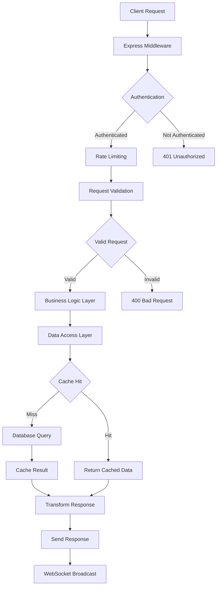
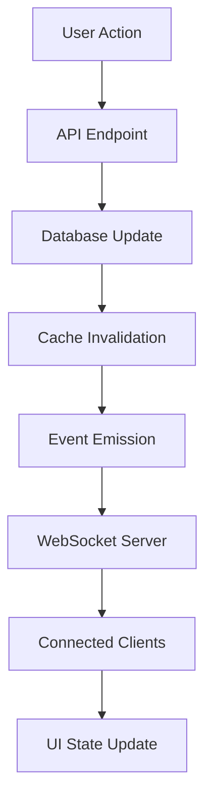
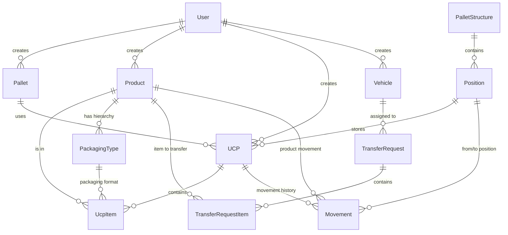
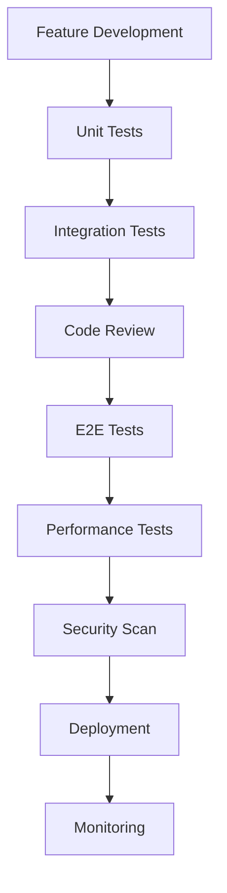

# WMS System Architecture Documentation

## Architecture Overview

The Warehouse Management System follows a modern, scalable architecture built with TypeScript, featuring a clear separation between frontend and backend components with real-time capabilities.

```
┌─────────────────────────────────────────────────────────────────────┐
│                        Client Applications                          │
├─────────────────────────────────────────────────────────────────────┤
│  React Frontend (Vite)  │  Mobile Web App  │  Progressive Web App   │
│  - Component Library    │  - Touch UI      │  - Offline Support     │
│  - State Management     │  - QR Scanner    │  - Service Worker      │
│  - Real-time Updates    │  - Camera API    │  - Push Notifications  │
└─────────────────────────────────────────────────────────────────────┘
                                    │
                            ────────┼────────
                                    │
┌─────────────────────────────────────────────────────────────────────┐
│                         API Gateway                                 │
├─────────────────────────────────────────────────────────────────────┤
│  Express.js Server                                                  │
│  - Authentication & Authorization                                   │
│  - Rate Limiting & Security                                         │
│  - Request Validation                                               │
│  - Response Compression                                             │
│  - CORS & Helmet Security                                           │
└─────────────────────────────────────────────────────────────────────┘
                                    │
                    ┌───────────────┼───────────────┐
                    │               │               │
┌─────────────────────┐ ┌─────────────────────┐ ┌─────────────────────┐
│   Business Logic    │ │   WebSocket Server  │ │   Background Jobs   │
├─────────────────────┤ ├─────────────────────┤ ├─────────────────────┤
│ - Domain Services   │ │ - Real-time Events  │ │ - Task Queue        │
│ - Use Cases         │ │ - Room Management   │ │ - Scheduled Tasks   │
│ - Validation Rules  │ │ - Broadcasting      │ │ - Data Processing   │
│ - Business Rules    │ │ - Connection Pool   │ │ - Report Generation │
└─────────────────────┘ └─────────────────────┘ └─────────────────────┘
                                    │
                    ┌───────────────┼───────────────┐
                    │               │               │
┌─────────────────────┐ ┌─────────────────────┐ ┌─────────────────────┐
│   Data Access       │ │   Caching Layer     │ │   File Storage      │
├─────────────────────┤ ├─────────────────────┤ ├─────────────────────┤
│ - Repository Pattern│ │ - Redis Cache       │ │ - Image Processing  │
│ - Database Queries  │ │ - Session Storage   │ │ - File Management   │
│ - ORM Integration   │ │ - Query Caching     │ │ - CDN Integration   │
│ - Transaction Mgmt  │ │ - Performance Opt   │ │ - Backup Strategy   │
└─────────────────────┘ └─────────────────────┘ └─────────────────────┘
                                    │
┌─────────────────────────────────────────────────────────────────────┐
│                      Database Layer                                 │
├─────────────────────────────────────────────────────────────────────┤
│  PostgreSQL Database                                                │
│  - ACID Compliance                                                  │
│  - Complex Relationships                                            │
│  - Advanced Indexing                                                │
│  - Full-text Search                                                 │
│  - JSON Support                                                     │
│  - Connection Pooling                                               │
└─────────────────────────────────────────────────────────────────────┘
```

## Technology Stack

### Frontend Architecture

```typescript
// React + TypeScript + Vite
frontend/
├── src/
│   ├── components/          // Reusable UI components
│   │   ├── ui/             // Base UI components (shadcn/ui)
│   │   ├── forms/          // Form components
│   │   ├── layout/         // Layout components
│   │   └── features/       // Feature-specific components
│   ├── pages/              // Page components
│   ├── hooks/              // Custom React hooks
│   ├── lib/                // Utility libraries
│   ├── types/              // TypeScript definitions
│   └── utils/              // Helper functions
```

**Key Technologies:**
- **React 18** - UI framework with concurrent features
- **TypeScript** - Type safety and developer experience
- **Vite** - Fast build tool and dev server
- **TanStack Query** - Server state management
- **Wouter** - Lightweight routing
- **Tailwind CSS** - Utility-first styling
- **Radix UI** - Accessible component primitives
- **Framer Motion** - Animation library

### Backend Architecture

```typescript
// Express.js + TypeScript + Clean Architecture
backend/
├── src/
│   ├── core/
│   │   ├── domain/         // Business entities and rules
│   │   ├── application/    // Use cases and DTOs
│   │   └── shared/         // Common types and utilities
│   ├── infrastructure/
│   │   ├── database/       // Database implementation
│   │   ├── cache/          // Caching implementation
│   │   ├── monitoring/     // Health checks and metrics
│   │   └── external/       // External service integrations
│   ├── presentation/
│   │   ├── http/           // REST API controllers
│   │   ├── websocket/      // WebSocket handlers
│   │   └── graphql/        // GraphQL resolvers (future)
│   └── middleware/         // Request/response middleware
```

**Key Technologies:**
- **Express.js** - Web framework
- **TypeScript** - Type safety
- **Drizzle ORM** - Type-safe database queries
- **PostgreSQL** - Primary database
- **Redis** - Caching and sessions
- **Socket.IO** - Real-time communication
- **Winston** - Logging
- **Helmet** - Security headers
- **Zod** - Schema validation

## Data Flow Architecture

### Request Processing Flow



### Real-time Data Flow



## Domain Model

### Core Entities and Relationships



### Business Domain Services

#### 1. Warehouse Management Service
- **Pallet Management**: Registration, tracking, status updates
- **Position Management**: Rack structure, availability, reservations
- **Space Optimization**: Intelligent positioning algorithms

#### 2. Inventory Management Service
- **Product Catalog**: SKU management, categorization, specifications
- **Stock Tracking**: Real-time inventory levels, location tracking
- **Packaging Hierarchy**: Multi-level packaging support

#### 3. UCP (Unit Load) Management Service
- **UCP Lifecycle**: Creation, modification, dissolution
- **Item Management**: Adding/removing products, quantity tracking
- **Transfer Operations**: Moving items between UCPs

#### 4. Transfer Planning Service
- **Vehicle Management**: Fleet registration, capacity planning
- **Transfer Requests**: Route planning, load optimization
- **Execution Tracking**: Real-time progress monitoring

#### 5. Packaging Composition Service
- **Algorithm Engine**: 3D bin packing, weight distribution
- **Constraint Validation**: Weight, volume, height limits
- **Optimization Reports**: Efficiency analysis, recommendations

## Security Architecture

### Authentication & Authorization

```typescript
// Session-based authentication with role-based access control
interface SecurityContext {
  user: {
    id: number;
    email: string;
    role: 'admin' | 'operator' | 'viewer';
    permissions: Permission[];
  };
  session: {
    id: string;
    expiresAt: Date;
    lastActivity: Date;
  };
}
```

### Security Layers

1. **Network Security**
   - HTTPS enforcement
   - CORS configuration
   - Rate limiting per IP
   - DDoS protection

2. **Application Security**
   - Input validation (Zod schemas)
   - SQL injection prevention
   - XSS protection
   - CSRF protection
   - Helmet security headers

3. **Data Security**
   - Database encryption at rest
   - Sensitive data hashing
   - Audit logging
   - Backup encryption

4. **Session Security**
   - Secure session cookies
   - Session timeout
   - Concurrent session limits
   - Activity monitoring

## Performance Architecture

### Caching Strategy

```typescript
// Multi-level caching implementation
interface CacheStrategy {
  levels: {
    l1: 'Memory Cache';        // In-memory for frequently accessed data
    l2: 'Redis Cache';         // Distributed cache for session data
    l3: 'Database Cache';      // Query result caching
    l4: 'CDN Cache';          // Static asset caching
  };
  policies: {
    ttl: number;              // Time to live
    maxSize: number;          // Memory limits
    evictionPolicy: 'LRU';    // Least Recently Used
  };
}
```

### Query Optimization

1. **Database Optimization**
   - Strategic indexing
   - Query plan analysis
   - Connection pooling
   - Read replicas (future)

2. **API Optimization**
   - Response compression
   - Pagination strategies
   - Lazy loading
   - Batch operations

3. **Frontend Optimization**
   - Code splitting
   - Tree shaking
   - Bundle optimization
   - Service worker caching

## Scalability Architecture

### Horizontal Scaling Considerations

```typescript
// Microservices preparation
interface ServiceBoundaries {
  userService: 'Authentication & User Management';
  inventoryService: 'Products & Stock Management';
  warehouseService: 'Pallets & Positions';
  transferService: 'Vehicle & Transfer Operations';
  compositionService: 'Packaging Algorithms';
  notificationService: 'Real-time Events';
}
```

### Load Balancing Strategy

1. **Application Load Balancing**
   - Multiple Express.js instances
   - Session affinity (sticky sessions)
   - Health check endpoints

2. **Database Load Balancing**
   - Read/write splitting
   - Connection pooling
   - Query optimization

3. **Cache Load Balancing**
   - Redis clustering
   - Cache partitioning
   - Failover strategies

## Monitoring & Observability

### Health Monitoring

```typescript
// Comprehensive health checks
interface HealthStatus {
  application: {
    status: 'healthy' | 'degraded' | 'unhealthy';
    uptime: number;
    version: string;
  };
  database: {
    connected: boolean;
    responseTime: number;
    connectionPool: PoolStatus;
  };
  cache: {
    connected: boolean;
    hitRate: number;
    memoryUsage: number;
  };
  external: {
    services: ExternalServiceStatus[];
  };
}
```

### Performance Metrics

1. **Application Metrics**
   - Request/response times
   - Error rates
   - Throughput
   - Memory usage

2. **Business Metrics**
   - Active UCPs
   - Transfer completion rates
   - Inventory accuracy
   - User activity

3. **Infrastructure Metrics**
   - CPU utilization
   - Memory consumption
   - Disk usage
   - Network latency

## Development Architecture

### Code Organization Principles

1. **Clean Architecture**
   - Domain-driven design
   - Dependency inversion
   - Single responsibility
   - Open/closed principle

2. **Testing Strategy**
   - Unit tests (Vitest)
   - Integration tests (Playwright)
   - E2E tests (comprehensive flows)
   - Performance tests

3. **CI/CD Pipeline**
   - Automated testing
   - Code quality checks
   - Security scanning
   - Deployment automation

### Development Workflow



## Future Architecture Considerations

### Planned Enhancements

1. **Microservices Migration**
   - Service decomposition
   - API gateway
   - Service mesh
   - Event-driven architecture

2. **Advanced Analytics**
   - Machine learning integration
   - Predictive analytics
   - Business intelligence
   - Real-time dashboards

3. **Mobile Applications**
   - React Native apps
   - Offline capabilities
   - Push notifications
   - Barcode scanning

4. **Integration Capabilities**
   - ERP system integration
   - IoT device connectivity
   - Third-party logistics
   - Automated guided vehicles

This architecture provides a solid foundation for the current WMS requirements while maintaining flexibility for future growth and enhancement.